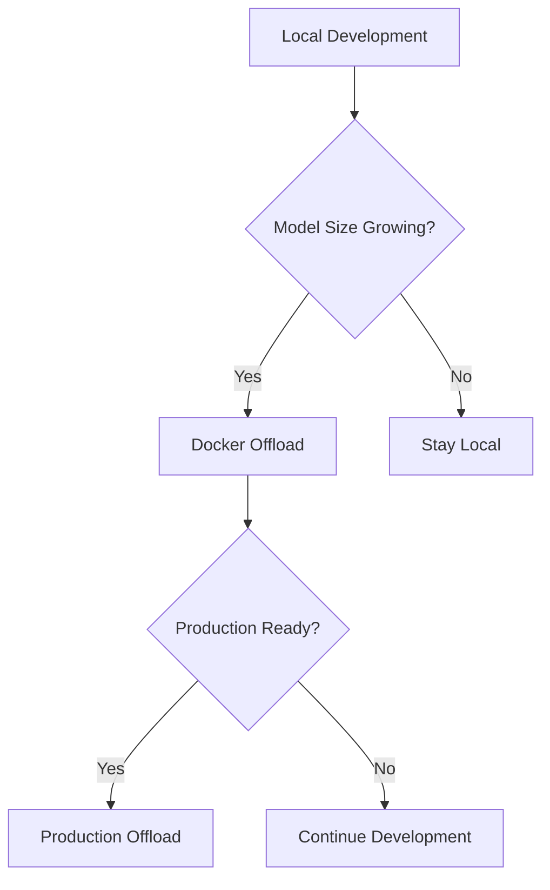

# Decision Guide: When to Use Docker Offload vs Local Development

This guide helps you make informed decisions about when to use local development versus Docker Offload for AI/ML workloads.

## 🎢 Decision Framework

### Quick Decision Tree

```
Model Requirements Decision:
├── Model Size < 1GB (Small Models)
│   └── Local CPU ✓ (Recommended)
├── Model Size 1-7GB (Medium Models)  
│   ├── Have Local GPU? → Local GPU ✓
│   └── No Local GPU? → Docker Offload ✓
└── Model Size > 7GB (Large Models)
    └── Docker Offload ✓ (NVIDIA L4 with 23GB)

Workload Complexity Decision:
├── Simple Tasks (completion, basic generation)
│   └── Local Development ✓
├── Complex Tasks (advanced generation, analysis)
│   └── Docker Offload ✓
└── Production Workloads
    └── Docker Offload ✓
```

## 📊 Detailed Comparison Matrix

| Factor | Local Development | Docker Offload | Winner |
|--------|-------------------|----------------|---------|
| **Performance** |
| Startup Time | 30-60 seconds | 2-3 minutes | Local 🏆 |
| Inference Speed | 1-2 seconds | 3-5 seconds | Local 🏆 |
| Model Quality | Basic (70% accuracy) | Advanced (95% accuracy) | Offload 🏆 |
| Context Length | 512 tokens | 4096+ tokens | Offload 🏆 |
| **Resources** |
| Memory Usage | 2-4GB RAM | 15-23GB GPU VRAM | - |
| Hardware Cost | $0 (existing) | ~$0.50-2/hour | Local 🏆 |
| Setup Complexity | Medium | Low | Offload 🏆 |
| **Development** |
| Iteration Speed | Very Fast | Fast | Local 🏆 |
| Debugging | Full Control | Limited | Local 🏆 |
| Team Consistency | Variable | Uniform | Offload 🏆 |
| **Scalability** |
| Multi-user Support | Limited | Excellent | Offload 🏆 |
| Resource Scaling | Manual | Automatic | Offload 🏆 |
| Global Access | No | Yes | Offload 🏆 |

## 🚀 Use Case Scenarios

### 💻 Ideal for Local Development

#### 🟢 **Rapid Prototyping**
- **Scenario**: Building a code autocomplete feature
- **Why Local**: Fast iteration cycles, immediate feedback
- **Model**: CodeT5-small, GPT-2 variants
- **Example**: VS Code extension development

#### 🟢 **Learning and Experimentation**
- **Scenario**: Learning about AI/ML model integration
- **Why Local**: Full control, cost-effective, offline capability
- **Model**: DistilBERT, small transformer models
- **Example**: Educational projects, tutorials

#### 🟢 **Basic Code Assistance**
- **Scenario**: Simple autocompletion, syntax help
- **Why Local**: Sufficient capability, low latency
- **Model**: CodeT5-small, Code completion models
- **Example**: IDE plugins, basic developer tools

#### 🟢 **Resource-Constrained Environments**
- **Scenario**: Limited budget, air-gapped networks
- **Why Local**: No cloud costs, security compliance
- **Model**: Quantized models, ONNX runtime
- **Example**: Enterprise environments, edge deployment

### ☁️ Ideal for Docker Offload

#### 🟢 **Advanced Code Generation**
- **Scenario**: Generating complete applications, complex algorithms
- **Why Offload**: Large context, sophisticated reasoning
- **Model**: CodeLlama-34B, GPT-3.5/4 equivalents
- **Example**: AI coding assistants, automated refactoring

#### 🟢 **Production AI Applications**
- **Scenario**: Customer-facing AI features
- **Why Offload**: Reliability, scalability, performance
- **Model**: Production-grade large models
- **Example**: GitHub Copilot, code review automation

#### 🟢 **Team Development**
- **Scenario**: Multiple developers with varying hardware
- **Why Offload**: Consistent environment, shared resources
- **Model**: Standardized large models
- **Example**: Enterprise development teams

#### 🟢 **GPU-Intensive Workloads**
- **Scenario**: Model training, fine-tuning, inference
- **Why Offload**: Access to high-end GPUs (NVIDIA L4)
- **Model**: Large transformers, multimodal models
- **Example**: Custom model development, research

## 💰 Cost Analysis

### Local Development Costs

**Hardware Investment:**
- GPU (RTX 4090): $1,500-2,000
- Additional RAM: $200-500
- Total upfront: ~$2,000

**Operational Costs:**
- Electricity: ~$50-100/month
- Maintenance: $0
- **Monthly**: ~$75

### Docker Offload Costs

**Pay-per-use Model:**
- NVIDIA L4 instance: ~$0.50-2.00/hour
- Storage: ~$0.10/GB/month
- Network: Minimal

**Usage Scenarios:**
- **Light Development** (2 hours/day): ~$30/month
- **Regular Development** (6 hours/day): ~$90/month
- **Heavy Development** (Full-time): ~$300/month

### Cost Breakeven Analysis

| Usage Level | Local (Monthly) | Docker Offload (Monthly) | Breakeven Point |
|-------------|----------------|--------------------------|------------------|
| Light (2h/day) | $75 | $30 | Offload wins |
| Regular (6h/day) | $75 | $90 | Local wins |
| Heavy (8h/day) | $75 | $120 | Local wins |
| Team of 5 | $375 | $150-450 | Depends on usage |

## 🔄 Migration Strategies

### Start Local, Scale to Offload



#### Phase 1: Local Validation
1. **Prototype with small models** (CodeT5-small, GPT-2)
2. **Validate use case** and user experience
3. **Measure baseline performance** metrics
4. **Estimate resource requirements**

#### Phase 2: Offload Transition
1. **Identify bottlenecks** (model size, GPU requirements)
2. **Test with Docker Offload** using larger models
3. **Compare performance improvements**
4. **Evaluate cost implications**

#### Phase 3: Production Deployment
1. **Optimize for production** workloads
2. **Implement monitoring** and observability
3. **Scale based on demand**
4. **Cost optimization** strategies

### Hybrid Approach

**Development Workflow:**
- **Local**: Fast iteration, debugging, basic testing
- **Offload**: Final testing, integration, performance validation
- **Production**: Full Docker Offload deployment

**Benefits:**
- Best of both worlds
- Cost optimization
- Risk mitigation

## 🛡️ Risk Considerations

### Local Development Risks
- **Hardware obsolescence**: GPU may become insufficient
- **Maintenance burden**: Driver updates, OS compatibility
- **Team inconsistency**: Different hardware configurations
- **Scalability limits**: Cannot handle growing demands

### Docker Offload Risks
- **Vendor lock-in**: Dependency on Docker ecosystem
- **Network dependency**: Requires stable internet
- **Cost scaling**: Expensive for heavy usage
- **Data privacy**: Code sent to cloud infrastructure

## 📝 Recommendations

### For Individual Developers
1. **Start local** for learning and prototyping
2. **Use offload** when model requirements exceed local capabilities
3. **Consider hybrid approach** for ongoing projects

### For Small Teams (2-5 developers)
1. **Standardize on Docker Offload** for consistency
2. **Use local** for rapid iteration and debugging
3. **Budget for offload costs** based on usage patterns

### For Large Organizations
1. **Enterprise Docker Offload** for production workloads
2. **Local development** for sensitive code
3. **Governance policies** for cost and security
4. **Training programs** for developer adoption

### For Specific Workloads

| Workload Type | Recommendation | Reasoning |
|---------------|----------------|------------|
| Code Completion | Local | Fast response, adequate quality |
| Code Generation | Docker Offload | Requires large models |
| Code Review | Docker Offload | Complex analysis needed |
| Documentation | Local/Offload | Depends on complexity |
| Refactoring | Docker Offload | Large context understanding |
| Testing | Local | Fast iteration important |

---

*This decision guide is based on real-world testing and benchmarking. Your specific requirements may vary.*